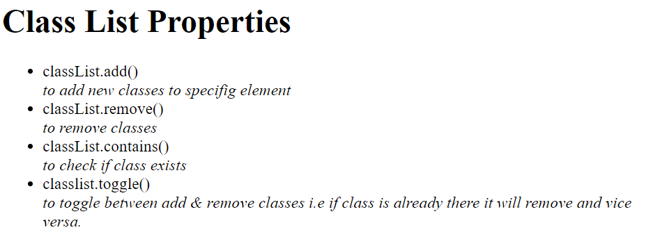
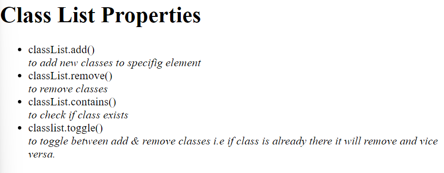
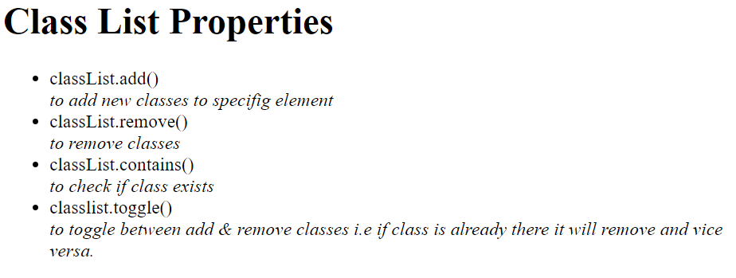

# `dom2.html`
# Explanation
### First Snippet:

`document.getElementsByTagName("li")` returns a collection (HTMLCollection) of all `<li>` elements in the document.
Attempting to set `li.innerHTML` on a collection will not work because `innerHTML` is a property of individual elements, not collections.

### Second Snippet:

`document.querySelector("li")`
returns the first `<li>` element it finds in the document.
Setting `li.innerHTML` on this single element works as expected, allowing you to modify its content.

# `dom3.html`
## Manipulation of Attributes
### Getting Attributes
```
let img = document.getElementById('displayedImage');
// Getter methos 
let name = img.getAttribute("src");
```

### Changing Attributes
```
img.setAttribute("src" , `${imageName}.png`);
```

## Changing Inline CSS with JS
```
let h1 = document.getElementById("h1")
h1.style.color = "green"
```

#### Note : Properties in CSS are written as `background-color`  where the same property in javascript is written as `backgroundColor`. Also Javascript changes Inline CSS not the external css.

---

# `dom5.html`
### Adding Class to element.
```
<ul id="methods">
        <div id="u" class="">
            <li >classList.add()</li>
            <i>to add new classes to specifig element</i>
            <li>classList.remove()</li>
            <i>to remove classes</i>
            <li>classList.contains()</li>
            <i>to check if class exists</i>
            <li>classlist.toggle()</li>
            <i>to toggle between add & remove classes 
            i.e if class is already there it will remove and vice versa.</i>
        </div>
    </ul>

    <style>
        #methods > .li {
            background-color: yellow;
        }
        #methods > .li2 {
            background-color: rgb(0, 251, 255);
        }


    </style>
    <script>
        let lists = document.getElementById("u");
        console.log(lists.classList);
    </script>
```
### Output 


### Removing CLass from element.
```
<ul id="methods">
        <div id="u" class="">
            <li >classList.add()</li>
            <i>to add new classes to specifig element</i>
            <li>classList.remove()</li>
            <i>to remove classes</i>
            <li>classList.contains()</li>
            <i>to check if class exists</i>
            <li>classlist.toggle()</li>
            <i>to toggle between add & remove classes 
            i.e if class is already there it will remove and vice versa.</i>
        </div>
    </ul>

    <style>
        #methods > .li {
            background-color: yellow;
        }
        #methods > .li2 {
            background-color: rgb(0, 251, 255);
        }


    </style>
    <script>
        let lists = document.getElementById("u");
        console.log(lists.classList);
        lists.classList.add("li2");
        lists.classList.remove("li2");
    </script>
```

### Output 



### Toggling the classes in elements
```
<ul id="methods">
        <div id="u" class="">
            <li >classList.add()</li>
            <i>to add new classes to specifig element</i>
            <li>classList.remove()</li>
            <i>to remove classes</i>
            <li>classList.contains()</li>
            <i>to check if class exists</i>
            <li>classlist.toggle()</li>
            <i>to toggle between add & remove classes 
            i.e if class is already there it will remove and vice versa.</i>
        </div>
    </ul>

    <style>
        #methods > .li {
            background-color: yellow;
        }
        #methods > .li2 {
            background-color: rgb(0, 251, 255);
        }


    </style>
    <script>
        let lists = document.getElementById("u");
        console.log(lists.classList);
        lists.classList.toggle("li");
        lists.classList.toggle("li");
    </script>
```

### Output
As you can see toggling class `li` two times will be effective same as no class. means. toggle function adds a class when it's absent and remove the class when present.



# `dom7.html`
### Children of particular of Tag.
```
<div id="div1">
        I am first div.
        <h1 id="h1">
            I am heading for div1
        </h1>
        <p id="paragraph">I am paragraph for div1</p>

        <ul id="ul1">
            I am list in div1
            <li id="li1">I am llist item1</li>
            <li id="li2">I am llist item2</li>
            <li id="li3">I am llist item3</li>
            <li id="li4">I am llist item4</li>
        </ul>
    </div>

    <script>
        let div = document.getElementById("div1");
        let children = div.children;
        console.log(children[0]);
    </script>
```

### 


### Finding parent element with child tag
```
<div id="div1">
        I am first div.
        <h1 id="h1">
            I am heading for div1
        </h1>
        <p id="paragraph">I am paragraph for div1</p>

        <ul id="ul1">
            I am list in div1
            <li id="li1">I am llist item1</li>
            <li id="li2">I am llist item2</li>
            <li id="li3">I am llist item3</li>
            <li id="li4">I am llist item4</li>
        </ul>
    </div>

    <script>
        let div = document.getElementById("div1");
        let children = div.children;
        let first_child = children[0];
        console.log(first_child.parentElement);
    </script>
```

### 

### Finding Next Siblings of Element.
```
<div id="div1">
        I am first div.
        <h1 id="h1">
            I am heading for div1
        </h1>
        <p id="paragraph">I am paragraph for div1</p>

        <ul id="ul1">
            I am list in div1
            <li id="li1">I am llist item1</li>
            <li id="li2">I am llist item2</li>
            <li id="li3">I am llist item3</li>
            <li id="li4">I am llist item4</li>
        </ul>
    </div>

    <script>
        let div = document.getElementById("div1");
        let children = div.children;
        let first_child = children[0];
        console.log(first_child.nextElementSibling);
    </script>
```

### Output
```
<p id="paragraph">I am paragraph for div1</p>
```

### Finding Previous Siblings of Element.
```
<div id="div1">
        I am first div.
        <h1 id="h1">
            I am heading for div1
        </h1>
        <p id="paragraph">I am paragraph for div1</p>

        <ul id="ul1">
            I am list in div1
            <li id="li1">I am llist item1</li>
            <li id="li2">I am llist item2</li>
            <li id="li3">I am llist item3</li>
            <li id="li4">I am llist item4</li>
        </ul>
    </div>

    <script>
        let div = document.getElementById("div1");
        let children = div.children;
        let first_child = children[0];
        let second_child = first_child.nextElementSibling;
        console.log(second_child.previousElementSibling);
    </script>
```

### Output
```
<h1 id="h1"> I am heading for div1 </h1>
```

