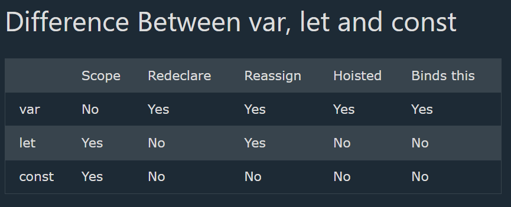

# `scope.html`
## Scope of JavaScirpt variables
When to use what ?
1. Always use const if the value should not be changed

2. Always use const if the type should not be changed (Arrays and Objects)

3. Only use let if you can't use const

4. Only use var if you MUST support old browsers.

## Types of Scopes in JavaScript
### Block Scope
`let` and `const`.

These two keywords provided Block Scope in JavaScript:

### Global Scope
Variables declared with the `var` always have Global Scope.

Variables declared with the `var` keyword can NOT have block scope:

## `let` keyword
The let keyword was introduced in ES6 (2015)

Variables declared with `let` have Block Scope

Variables declared with `let` must be Declared before use

Variables declared with `let` cannot be Redeclared in the same scope

---
## `const`

## `var`

### `let` with block scope
```
let x = "hii"
let a = 7
if( a ===7 )
{
    let x = "hello"
}

console.log(x);
```
### Output
```
hii
```
---

### `let` with gloabal scope
```
let x = "hii"
let a = 7
if( a ===7 )
{
    x = "hello"
}

console.log(x);
```
### Output
```
hello
```

---
### `var` with global scope and redeclaration
```
var x = "hii"
let a = 7
if( a ===7 )
{
    var x = "hello"
}
console.log(x);
```

### Output 
```
hello
```
---
### Since var always have global scope it can be redeclared immediately.
```
var x = "John Doe";
var x = 0;
console.log(x);
```

### Output
```
0
```
# `Whereas`
---
### 
```
let x = "John Doe";
let x = 0;
console.log(x);
```

### Output
```
Uncaught SyntaxError: Identifier 'x' has already been declared
```

