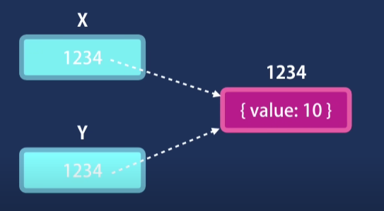

# Java Script Data Types
It has two main types of types. 

#### 1. Primitives types
1. String.
2. Number.
3. Bigint.
4. Boolean.
5. Undefined.
6. Symbol.
7. Null.

#### 2. Objects types
1. Objects
2. Functions
3. Arrays

# Copy in javascript.
### Objects
```
let x = {value : 10};
let y = x;
x.value = 20;

console.log(y);
```
### Output
```
{value: 20}
```

### Primitives
```
let x = 10;
let y = x;
x = 20;

console.log(y);
```
### Output
```
10
```

This is what happens when copying with objects. the `x` and `y` both are pointing to same object. so changing either of them will affect the other.


### Conclusion
Primitives are copied by their value.
Hence they are independant and seperate.

Objects are copied by their references. Hence they are same.

## Let's see another example.
### Passing of Primitives
```
let x = 10;
function increment(primitive)
{
    primitive++;
}
increment(x);

console.log(x);
```
### Output
```
10
```

### Passing of Objects
```
let x = {value : 10};
function increment(object)
{
    object.value++;
}
increment(x);

console.log(x);
```
### Output
```
{value: 11}
```


